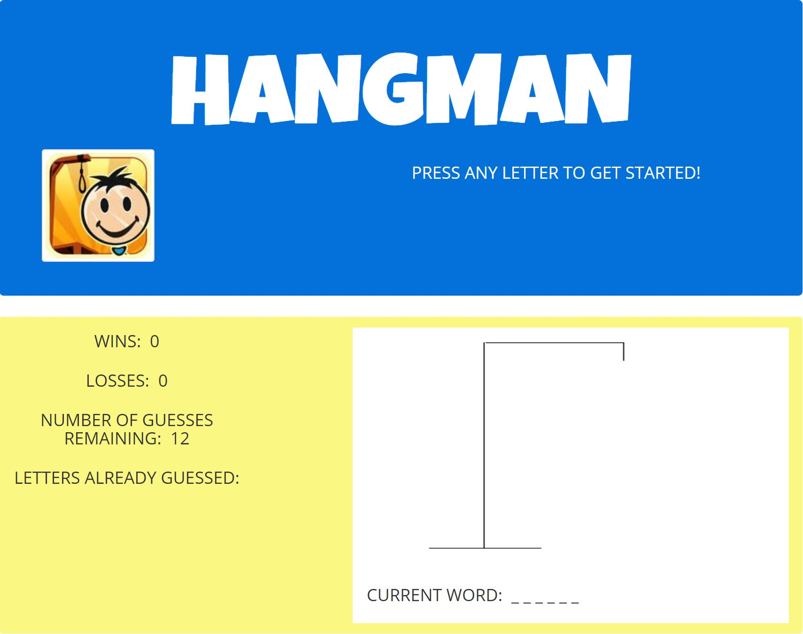

# Hangman-Game

This application is an old-fashioned Hangman game powered by JavaScript to dynamically update HTML.

The user has 12 chances to guess a computer generated word. If you guess a letter in the word, you do not lose a guess. If you do not guess a letter in the word, the number of guesses decreases by one. Each wrong guess results in another piece of the hangman being drawn. The application keeps track of already guessed letters and does not allow guesses which are not letters of the alphabet. The application also keeps track of all games won and lost. 

Good=luck and don't get "hanged"!

## Site Preview

## Getting Started

You should be able to download the files via the github pages link below and run locally on your computer:

[https://github.com/emswann/Hangman-Game.git](https://github.com/emswann/Hangman-Game.git).

You can also access the application via the github pages link below:

[https://emswann.github.io/Hangman-Game/](https://emswann.github.io/Hangman-Game/).

## Prerequisites

No prior software needed to run.

## Built With

* [Bootstrap](https://getbootstrap.com/docs/3.3/) - Front-end HTML, CSS, javascript framework for creating responsive web applications. 
* [JavaScript](https://www.javascript.com/) - Programming language.

## Contributing

Please feel free to offer any suggestions. As always, programming is a work of art in progress.

## Author

* **Elaina Swann** - [Github](https://github.com/emswann)

